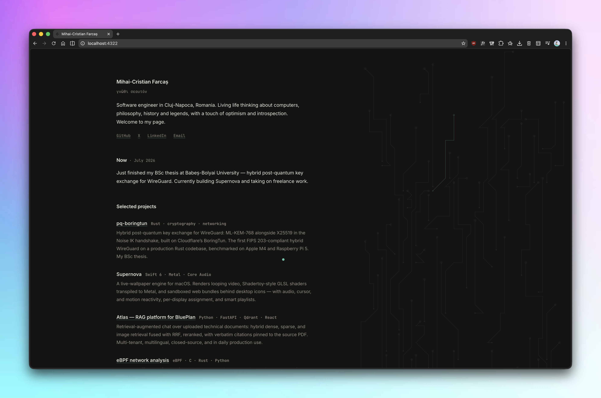

# mihaicristian.dev

My personal site — a single left-anchored column of text, a bit of writing, and
a procedural pattern drifting in the margin. Built with [Astro](https://astro.build),
hand-written CSS, and no component libraries.



Live at [mihaicristian.dev](https://mihaicristian.dev).

## Running it

```sh
bun install
bun dev
```

Then open http://localhost:4321. Other scripts:

- `bun run build` — build the static site to `dist/`
- `bun run preview` — serve the build locally
- `bun run check` — type-check the Astro and TypeScript files

Any recent Node works too if you'd rather use `npm`.

## Layout

```
src/
  components/   CustomCursor, PassionPattern, WritingTimeline
  content/      the writing, as Markdown/MDX
  data/         site metadata (site.ts) and the quote list (quotes.ts)
  layouts/      Base.astro — the shared <head>, fonts, and shell
  pages/        index, the 404, /writing, and the RSS feed
  styles/       global.css — colors, type, and the reset
```

## Writing a post

Drop an `.mdx` (or `.md`) file into `src/content/writing/`. The filename becomes
the URL slug. Each post needs a little frontmatter:

```mdx
---
title: 'Be Curious'
description: 'A line for the listing and the RSS feed.'
date: 2025-02-13
draft: false   # optional — drafts are hidden in production
---

Your words here.
```

New posts show up on the home page, the `/writing` timeline, and in `rss.xml`
automatically, newest first.

## A few notes on the design

- **One column, anchored left.** No header, no footer, no theme toggle. Light and
  dark come straight from the system preference.
- **The margin pattern.** Every load draws one of five procedural motifs — one per
  thing I care about (circuits, a labyrinth, a map grid, a helix, a star field).
  Force one with `?pattern=0..4` if you want to see a specific one.
- **The cursor** is a small accent-colored dot that lags the pointer and becomes a
  crosshair over links. It steps aside for touch and reduced-motion.

Everything degrades gracefully: the ornament is decorative, hidden from screen
readers and on narrow screens, and the site reads fine without any of it.
